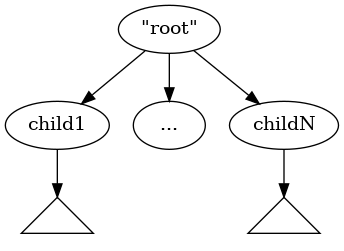

# XSLT-like transformations over python lists

## Installation

Select a zip on the [releases page](https://github.com/olpa/python-lxslt/releases), give the path to `pip` directly or through `requirements.txt`.

```
pip install https://github.com/olpa/python-lxslt/archive/refs/tags/v0.1.0.zip
```

## Sample XPath-like

```
$ cat sample-xpath.py
import lxslt

tree = ['tree',
        ['child1', 'a'],
        ['child2', 'b'],
        ['child1', 'c'],
        ['child2',
            ['sub-child2', 'd']], ['child2']]

back = lxslt.select(
        tree,
        [lxslt.SelectStep(lxslt.MatchName('child1'))])

print(back)

$ python sample-xpath.py
[['child1', 'a'], ['child1', 'c']]
```

## Sample XSLT-like

```
$ cat ./sample-xslt.py
import lxslt

tree = ['root',
        ['child', 'anything here', '234234'],
        ['sub',
            ['child', 'ignored']]]

templates = [
        lxslt.Rule(lxslt.MatchName('child'), lxslt.Replace([['new-child']]))
        ]

back = lxslt.apply_templates(templates, tree)
print(back)

$ python sample-xslt.py
[['root', ['new-child'], ['sub', ['new-child']]]]
```

# Documentation

## L-expression

L-expressions, or just lexp, where "L" stands for "list", use Python lists to represent trees. An example: a node with children:



The corresponding lexp:

```
["root", child1, ..., childN]
```

The first element (the index "0") of the list is the parent node. The type of the element should be "string". The rest of the list are children, from left to right.

As a convenience, the leafes can be represented as strings instead of one-element lists:

```
# The most correct definition
["root", ["leaf-child1"], ..., ["leaf-childN"]]
# Supported alternative
["root", "leaf-child1", ..., "leaf-childN"]
```

## Nodeset

If the first element of the list is _not a string_, then the list is _not a node_ but a _list of nodes_, or _nodeset_.

```
nodeset = [["node1", ...], ["node2", ...], ["node3", ...]]
node = ["new-node", *nodeset]
```

In the example above, the variable `nodeset` defines a nodeset of three nodes, `node1`, `node2` and `node3`.

If one prepends a string to a nodeset, one gets a normal node (in the example, the variable `node`). If one has a node and takes everything without the first element, he gets a nodeset.

